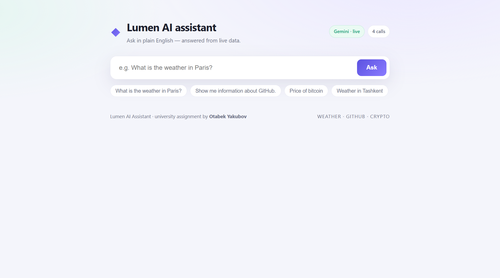

# Lumen — Ask Your Data

Type a question in plain English. Lumen figures out which public API can answer
it, fetches **live** data from the internet, and Google Gemini writes a short
answer using only what was fetched. Every request also returns a step-by-step
trace so you can see the routing decision, the real HTTP call, and how the
answer was produced.

> University assignment (Homework 1: *Simple AI Data Assistant*) by **Otabek Yakubov**.

---

## What it can answer

| You ask… | Lumen calls… | Example |
| --- | --- | --- |
| the weather somewhere | **wttr.in** | "What is the weather in Paris?" |
| about a GitHub user or repo | **GitHub REST API** | "Show me information about GitHub." |
| a crypto price | **CoinGecko** | "Price of bitcoin" |

None of these APIs need a key, so the project costs nothing to run.

---

## How it works

Each question flows through a three-step pipeline (`core/engine.py`):

1. **Route** (`core/router.py`) — Gemini is asked to reply with strict JSON
   naming the source and its parameters, e.g.
   `{"source": "weather", "params": {"city": "Paris"}}`. If there is no key or
   Gemini is unreachable, a deterministic keyword matcher does the same job.
2. **Fetch** (`core/connectors.py`) — based on that decision, Lumen calls the
   matching public API and records the URL, status code, and timing.
3. **Respond** (`core/responder.py`) — the raw JSON is handed back to Gemini,
   which summarises **only that data** into 2–3 plain sentences. A local
   template produces the same kind of answer if the model is unavailable.

Because the whole pipeline has an offline fallback, **the app works end to end
even with no API key** — it still fetches real data; only the wording is done by
a template instead of the model.

Extras that make it robust: a 10-minute in-memory answer cache, exponential
backoff when Gemini returns a `429` rate limit, and a session counter of real
Gemini calls shown in the header.

---

## Project layout

```
lumen/
├── app.py                # Flask server + routes (/, /api/query, /api/health)
├── selftest.py           # offline test: router + live APIs, no key needed
├── requirements.txt
├── .env.example          # copy to .env and add a key (optional)
├── core/
│   ├── config.py         # all settings in one place
│   ├── llm.py            # Gemini wrapper (retry/backoff, graceful fallback)
│   ├── router.py         # step 1: pick the source
│   ├── connectors.py     # step 2: the three API connectors
│   ├── responder.py      # step 3: write the answer
│   ├── trace.py          # collects the step-by-step timeline
│   └── engine.py         # orchestrates the pipeline + cache
├── templates/index.html  # the single page
└── static/               # style.css + app.js
```

---

## Setup

Requires Python 3.9+.

```bash
# 1. create a virtual environment and install dependencies
python3 -m venv .venv
source .venv/bin/activate
pip install -r requirements.txt

# 2. (optional) add a free Gemini key for live LLM answers
cp .env.example .env
#    then paste your key into GEMINI_API_KEY inside .env

# 3. run
python app.py
```

Open <http://127.0.0.1:5000>. Get a free Gemini key (no credit card) at
<https://aistudio.google.com/app/apikey>. Without a key the app still runs and
fetches real data using the offline fallback.

### Quick check without the browser

```bash
python selftest.py
```

## Screenshots

### Homepage


### Weather query (Tashkent)


### GitHub query


### Crypto query (Bitcoin)


This routes a batch of questions and hits all three live APIs using the offline
templates — a fast way to confirm everything is wired up.
